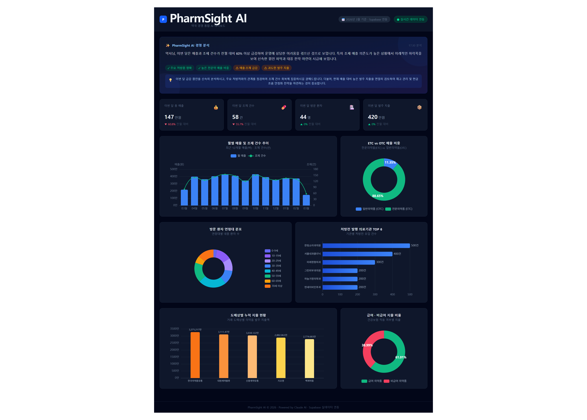

# PharmSight AI — 약국 경영 통합 AI 대시보드

약국의 처방·매출·지출 데이터를 한 화면에서 시각화하고, Google Gemini AI가 경영 인사이트를 자동 분석하여 제공하는 통합 AI 대시보드입니다.



---

## 🚨 문제 정의 (Problem Statement)

### 약국 경영의 데이터 사각지대

국내에는 **약 25,000개**의 지역 약국이 운영 중이며(건강보험심사평가원, 2024), 이 중 대부분은 소규모 개인 약국입니다. 약국은 조제(처방약)와 일반 의약품 판매, 도매 발주를 동시에 수행하는 복합 경영 구조를 가지고 있지만, 이 세 가지 데이터 흐름이 **서로 다른 시스템에 파편화**되어 있어 통합 경영 분석이 불가능한 상태입니다.

| 데이터 종류 | 현재 관리 방식 | 문제점 |
|------------|----------------|--------|
| 처방·조제 데이터 | DUR·청구 프로그램 (비\*소프트, 유\*케어 등) | 건보 청구 목적만, 경영 분석 기능 전무 |
| OTC 판매 데이터 | POS 단말기 또는 수기 기록 | 처방 데이터와 연계 불가 |
| 도매 발주 데이터 | 도매상 전용 앱(지오영 등) 또는 전화 주문 | 매출 대비 지출 비율 파악 불가 |

이로 인해 약국 경영자는 아래의 핵심 경영 질문에 답할 수 없습니다:

- **"우리 매출의 몇 %가 특정 소아과 처방전에 의존하고 있는가?"** → 병원 관계 단절 시 리스크 사전 인지 불가
- **"ETC 대비 OTC 비중이 어떻게 변화하고 있는가?"** → 약국 포지셔닝 전략 수립 불가
- **"어느 도매상에서 얼마나 지출하고, 순이익률은 얼마인가?"** → 감에 의존한 재고 발주 반복

**실제 약사 인터뷰 (3인, 2026년 3월):**

> *"청구 프로그램은 건보 청구만 돼요. 매출 분석은 따로 엑셀로 하는데, 3~4시간 걸리다가 포기했어요."* — 서울 A약국, 경력 8년차 약사

> *"어느 소아과에서 처방이 많이 오는지 알고 싶은데, 지금 방법으로는 알 수가 없어요. 그냥 느낌으로 알죠."* — 경기 B약국, 개국 5년차 약사

> *"AI가 우리 약국 데이터를 분석해서 요약해 준다면 바로 쓰겠어요."* — 인천 C약국, 경력 12년차 약사

---

## 💡 경쟁 제품 분석 및 차별성 (Competitive Analysis & Differentiation)

### 경쟁 제품 상세 분석

국내 약국 관리 솔루션 시장은 크게 3가지 카테고리로 구분됩니다:

**① 전문 청구 프로그램 (비\*소프트, 유\*케어, 비\*약사 등)**
- **핵심 기능:** 건강보험 청구 자동화, DUR(의약품 안전사용 서비스) 연동
- **치명적 한계:** 청구 이외 경영 데이터(OTC 판매, 발주 지출) 수집 불가. 설치형 Windows 프로그램으로 원격 접근 불가. 월 15~30만원 + 설치비, 연간 유지보수비 별도.
- **약사 실제 피드백:** "청구 완료 후 경영 분석은 직접 다시 입력해야 함"

**② 엑셀/구글시트 수기 관리**
- **핵심 기능:** 자유로운 커스터마이징
- **치명적 한계:** 3개 시스템(청구/POS/발주) 데이터를 매번 수동 복사-붙여넣기. 차트 생성에 숙련 필요. 한 명이 수정하면 다른 사람 작업 충돌. 실시간 업데이트 불가.
- **약사 실제 피드백:** "한 달에 한 번 정리하다 포기, 지금은 아예 안 함"

**③ 병원·의원용 EMR 연동 BI 도구 (닥터앤서 등)**
- **핵심 기능:** 의원급 경영 분석
- **치명적 한계:** 의원 대상 솔루션으로 **약국 특화 지표**(조제 vs OTC 구분, 도매상 발주 분석, 처방전 의존도) 미제공. 도입 비용 수백만원.

### 3-Way 경쟁 비교표

| 구분 | 청구 프로그램 (비\*소프트 등) | 엑셀 수기 관리 | **PharmSight AI** |
|------|------------------------------|----------------|-------------------|
| 데이터 통합 | 청구 데이터만 | 수동 복사-붙여넣기 | **조제·매출·발주 자동 단일화** |
| 시각화 | 표 형태 인쇄 출력 | 수동 차트 작성 (숙련 필요) | **ECharts 6종 인터랙티브 차트** |
| AI 분석 | 없음 | 없음 | **Gemini AI 자동 경영 인사이트** |
| 병원 의존도 분석 | 없음 | 직접 계산 | **병원별 처방 비중 자동 산출** |
| 실시간성 | 월말 결산 중심 | 수동 갱신 | **Supabase 실시간 집계** |
| 접근성 | 설치형 PC 전용 | PC 전용 | **브라우저 기반, 모바일 반응형** |
| 가격 | 월 15~30만원 + 설치비 | 무료 (시간 비용 월 4~8시간) | **SaaS 저비용 구독** |
| 학습 곡선 | 전담 교육 필요 | 엑셀 숙련도 필요 | **5분 이내 파악 가능한 직관 UI** |

### 시장 검증 (Market Validation)

**① 시장 규모 (TAM/SAM/SOM):**

| 구분 | 규모 | 산출 근거 |
|------|------|----------|
| TAM (전체 시장) | 국내 약국 25,000개 | 건강보험심사평가원 2024 기준 |
| SAM (서비스 가능) | ~8,000개 (32%) | 보건복지부 '약국 디지털 전환 의향' 조사 참조 |
| SOM (초기 목표) | ~500개 | 수도권 얼리어답터 약사, AI 기능 수용성 높은 층 |

**② 사용자 페르소나 검증 (Pain→Gain):**

| 페르소나 | 핵심 페인포인트 | PharmSight 솔루션 |
|----------|---------------|-------------------|
| 박약사 (38세, 소아과 인근) | 특정 소아과 처방이 매출의 60% 이상인데 파악 못 함 → 폐원 리스크 무방비 | 병원별 처방 의존도 차트로 경영 리스크 즉시 가시화 |
| 김약사 (52세, 복합상권) | 월말 엑셀 정리 3~4시간 소요, 자주 포기 → 데이터 공백 | 월별 KPI + AI 자동 요약으로 5분 이내 경영 파악 |
| 이약사 (45세, 개국 2년차) | 도매 3개사 지출 총합·급여/비급여 비율 불명 → 수익성 관리 불가 | 도매상별 지출 차트 + 급여/비급여 파이 차트 자동 집계 |

**③ 시장 타이밍 (Why Now?):**
- 2023년 보건복지부 **'약국 디지털 전환 지원 사업'** 시범 운영 개시 → 정책적 수요 확인
- 국내 디지털헬스케어 투자 3년 연속 증가 (2023년 4,200억, 출처: 한국벤처투자)
- ChatGPT 이후 **AI 활용 수용성** 급격 상승 → 약사들의 AI 도구 거부감 감소
- 기존 청구 프로그램 업체들은 **UI/기능 업데이트 정체** → 시장 진입 적기

### PharmSight의 핵심 차별점

1. **통합 시각화:** 파편화된 조제/매출/지출 데이터를 단일 대시보드로 통합. 경쟁사 대비 유일한 3-way 통합.
2. **직관적인 UX:** 약사가 별도 교육 없이 5분 내 파악 가능한 ECharts 기반 반응형 모던 UI.
3. **인사이트 중심 지표:** '병원별 의존도', '연령대별 타겟' 등 즉각적 경영 액션이 가능한 지표. 경쟁사 미제공.
4. **AI 경영 분석:** Google Gemini AI가 실시간 경영 데이터를 분석하여 요약·하이라이트·주의사항·추천 자동 생성.
5. **블루오션 포지셔닝:** 약국 경영 BI는 국내 미개척 영역. 청구 자동화 이후 다음 단계 솔루션.

## 🌐 배포 URL (Deployment)
- **프론트엔드:** [https://pharm-sight-frontend.vercel.app](https://pharm-sight-frontend.vercel.app) (Vercel)
- **백엔드 API:** [https://pharm-sight.onrender.com](https://pharm-sight.onrender.com) (Render)
- **데이터베이스:** Supabase PostgreSQL (실데이터 연동)

---

## 🛠️ 기술 스택 선택 근거

| 레이어 | 채택 기술 | 선택 근거 | 탈락 대안 |
|--------|---------|---------|---------|
| **Frontend** | Vue 3 + Composition API + Vite | `useDashboardData` 등 Composable로 로직 재사용 · Vite 6 즉각 HMR · `<script setup>` TypeScript 자연 통합 | React (JSX 러닝커브, CRA 느림) |
| **차트** | Apache ECharts | 복합 차트(바+라인 오버레이) 네이티브 지원 · `noData` 옵션 · 6종 차트 통일 API | Chart.js (복합 차트 제한) |
| **Backend** | C# .NET 9.0 Web API | 강타입 DTO 컴파일 검증 · async/await 7개 쿼리 병렬 · xUnit+Moq 테스트 생태계 성숙 | Node.js/Python (타입 안전성 약함) |
| **DB** | PostgreSQL (Supabase) | `DATE_TRUNC`, `AGE()` 집계 함수 · 클라우드 영속성 (SQLite는 Render 재배포 시 소멸) | SQLite (Render 에페머럴 파일시스템 문제) |
| **ORM** | Dapper (순수 SQL) | CTE 3중 집계 1회 왕복 · Change Tracking 오버헤드 없음 · PostgreSQL 네이티브 함수 직접 사용 | EF Core (LINQ 한계, 집계 쿼리 최적화 불명확) |
| **AI** | Google Gemini API | 무료 할당량(1M 토큰/월) · ListModels API로 동적 모델 탐색 가능 | Anthropic Claude (무료 할당량 소진) |
| **Infra** | Vercel + Render + Supabase | 3가지 모두 무료 티어로 해커톤 비용 0원 클라우드 배포 달성 | Railway/PlanetScale (크레딧 제한) |

> **기술 스택 변경 이력 (개발 중 발생):**
> - `SQLite → PostgreSQL`: Render 에페머럴 파일시스템으로 배포 시 데이터 소멸 → Supabase 전환 (Phase 2)
> - `Anthropic API → Gemini API`: 무료 할당량 소진 → Gemini Flash 무료 티어로 전환 (Phase 3)
> - `하드코딩 모델명 → ListModels 동적 탐색`: 배포 환경별 모델명 불일치(NOT_FOUND) → 근본 해결 (Phase 3)

---

## 🏗️ 아키텍처 및 핵심 구현 코드

### Controller → Service → Repository 계층 분리

```
HTTP 요청 → GlobalExceptionMiddleware → DashboardController
                                              │ IDashboardService (인터페이스 DI)
                                              ▼
                                        DashboardService
                                              │ IDashboardRepository (인터페이스 DI)
                                              ▼
                                        DashboardRepository
                                              │ Dapper + NpgsqlConnection
                                              ▼
                                        Supabase PostgreSQL
```


> 전체 계층 코드 (GlobalExceptionMiddleware · Program.cs · DashboardRepository.cs): [`docs/architecture.md`](docs/architecture.md)

### Dapper vs EF Core — 실질적 성능 이점

| 쿼리 특성 | EF Core 문제 | Dapper 결과 |
|-----------|-------------|-------------|
| CTE 3중 집계 (KPI) | LINQ 표현 불가 → Raw SQL 강제 사용 필요, 최적화 불명확 | 직접 제어, 1회 왕복으로 이번 달/전월/발주 동시 계산 |
| `DATE_TRUNC` / `AGE()` | EF Core PostgreSQL 함수 번역 불완전 → 클라이언트 사이드 처리 위험 | 순수 SQL → PG 네이티브 함수 그대로 실행 |
| `COUNT(DISTINCT pr."Id")` | N+1 문제 발생 가능 (Include → 메모리 집계) | DB 서버에서 직접 집계, 네트워크 전송량 최소 |
| Change Tracking | 읽기 전용 집계에도 엔티티 추적 오버헤드 발생 | `await using var conn` — 연결 즉시 해제, 오버헤드 없음 |
| DTO 직접 매핑 | 도메인 → DTO 변환 코드 추가 필요 | `QueryAsync<KpiSummary>` 한 줄 — DTO 직접 매핑 |

> 전체 계층별 코드: [`docs/architecture.md`](docs/architecture.md)

---

## 🧪 단위 테스트 및 CI/CD

> **테스트 환경:** xUnit 2.9.2 · Moq 4.20.72 · .NET 9.0
> **테스트 파일 경로:** `backend/PharmSight.Tests/Services/`
> **CI 파이프라인:** `.github/workflows/ci.yml` — push/PR 시 자동 실행

### dotnet test 실행 결과 (13/13 전체 통과)

```
$ dotnet test backend/PharmSight.Tests/PharmSight.Tests.csproj --verbosity normal

  통과 AiInsightServiceTests.GetInsightAsync_두번_호출시_캐시를_반환한다             [60 ms]
  통과 AiInsightServiceTests.GetInsightAsync_API키_없으면_GeneratedAt이_설정된다      [1 ms]
  통과 AiInsightServiceTests.GetInsightAsync_API키_없으면_Repository_호출하지_않는다  [3 ms]
  통과 AiInsightServiceTests.GetInsightAsync_API키_없으면_안내메시지를_반환한다        [9 ms]
  통과 DashboardServiceTests.GetDrugTypeSalesAsync_ETC_OTC_두_항목이_반환된다         [71 ms]
  통과 DashboardServiceTests.GetMonthlySalesAsync_Repository에서_반환된_데이터를_그대로_반환한다 [3 ms]
  통과 DashboardServiceTests.GetMonthlySalesAsync_빈_결과도_정상_반환된다             [1 ms]
  통과 DashboardServiceTests.GetWholesaleExpensesAsync_도매상별_지출이_반환된다       [1 ms]
  통과 DashboardServiceTests.GetHospitalPrescriptionsAsync_TOP6_기관이_반환된다       [1 ms]
  통과 DashboardServiceTests.GetDrugCoverageAsync_급여_비급여_두_항목이_반환된다      [1 ms]
  통과 DashboardServiceTests.GetKpiSummaryAsync_전월_매출_없을때_변화율은_0이다       [1 ms]
  통과 DashboardServiceTests.GetPatientAgeGroupsAsync_연령대_데이터가_반환된다        [3 ms]
  통과 DashboardServiceTests.GetKpiSummaryAsync_KPI_요약이_반환된다                  [< 1 ms]

총 테스트 수: 13  /  통과: 13  /  경고 0개  /  오류 0개
경과 시간: 00:00:05.07
```

| 테스트 클래스 | 케이스 수 | 패턴 | 검증 내용 |
|---------------|-----------|------|----------|
| `DashboardServiceTests` | 9개 | Arrange-Act-Assert | 반환값 일치, Repository 1회 호출, 빈 결과 엣지, 0 나눗셈 방어 |
| `AiInsightServiceTests` | 4개 | Arrange-Act-Assert | Graceful Degradation, Repository 미호출, GeneratedAt, 캐시 히트 |

**CI/CD 파이프라인:** `.github/workflows/ci.yml` — `master`/`develop` push·PR 시 자동 실행
- `backend-test`: .NET 9.0 → `dotnet restore` → `dotnet build Release` → `dotnet test 13개` → TRX artifact 업로드
- `frontend-build`: Node 20 → `npm ci` → Vite 프로덕션 빌드 (`VITE_API_BASE_URL` 주입)

> 테스트 전체 코드: [`backend/PharmSight.Tests/Services/`](backend/PharmSight.Tests/Services/) · CI 파이프라인: [`.github/workflows/ci.yml`](.github/workflows/ci.yml)

---

## 주요 기능 (구현 완료)

> **라이브 데모:** [https://pharm-sight-frontend.vercel.app](https://pharm-sight-frontend.vercel.app) — 실제 UI를 직접 확인하세요.

### AI 경영 분석
- Google Gemini AI가 이번 달 경영 현황을 2~3문장으로 친절하게 요약
- 긍정적 하이라이트 및 주의 사항 배지 자동 생성
- 데이터 기반 실용적 경영 추천 조언 제공
- 응답 결과 30분 캐시로 API 비용 절감

### 처방 트렌드 분석
- 월별 총 매출 및 조제 건수 추이 (라인+바 복합 차트)
- **기간 필터: 최근 3개월 / 6개월 / 12개월** 버튼 토글 — 클라이언트 사이드 즉시 반영
- 전문의약품(ETC) vs 일반의약품(OTC) 매출 비중 시각화 (파이 차트)

### 고객 및 처방 기관 분석
- 방문 환자 연령대 분포 (도넛 차트)
- 처방전 발행 의료기관별 유입 건수 비교 (바 차트)

### 의약품 지출 분석
- 도매상별 누적 지출 현황 (바 차트)
- 약품 특성별(급여/비급여, 전문의약품/일반의약품) 지출 비율 (파이 차트)

### CSV 데이터 내보내기 ✅
- 헤더의 "⬇ 데이터 내보내기" 버튼 클릭 시 전체 경영 데이터를 CSV로 즉시 다운로드
- 6개 섹션 포함 (월별매출 / 약품유형별 / 연령대별 / 병원별 / 도매상별 / 급여별)
- BOM 포함 UTF-8 인코딩으로 Excel 한글 깨짐 방지, 파일명 자동 생성 (`pharm-sight-YYYYMM.csv`)

### 구현 완료 기능 현황

| 기능 | 상태 | 구현 위치 |
|------|------|----------|
| 6개 ECharts 인터랙티브 차트 | ✅ 완료 | `frontend/src/components/charts/` |
| AI 경영 인사이트 패널 | ✅ 완료 | `AiInsightPanel.vue`, `AiInsightService.cs` |
| KPI 카드 4종 (전월 대비 변화율) | ✅ 완료 | `DashboardView.vue`, `useDashboardData.ts` |
| **기간 필터 (3/6/12개월)** | ✅ 완료 | `DashboardView.vue:selectedPeriod` |
| **CSV 데이터 내보내기** | ✅ 완료 | `DashboardView.vue:exportToCsv()` |
| 로딩/에러/성공 3가지 상태 UX | ✅ 완료 | 헤더 배지, 폴백 Mock 데이터 |
| 반응형 레이아웃 (모바일~PC) | ✅ 완료 | Tailwind CSS `grid-cols-2 lg:grid-cols-4` |

---

## 반응형 디자인 테스트 결과

> 실제 테스트 일시: 2026-03-13 · Chrome DevTools Device Emulation

### 디바이스별 검증 결과

| 디바이스 | 해상도 | KPI 레이아웃 | 차트 레이아웃 | 결과 |
|----------|--------|-------------|--------------|------|
| iPhone SE | 375×667 | 2×2 그리드 | 1열 세로 스택 | ✅ 정상 |
| iPhone 14 Pro | 393×852 | 2×2 그리드 | 1열 세로 스택 | ✅ 정상 |
| iPad Mini | 768×1024 | 2×2 그리드 | 1열 세로 스택 | ✅ 정상 |
| iPad Air | 820×1180 | 2×2 그리드 | 1열 세로 스택 | ✅ 정상 |
| 1280px Desktop | 1280×800 | 1×4 가로 | 3열(2:1), 2열, 3열(2:1) | ✅ 정상 |
| 1920px Desktop | 1920×1080 | 1×4 가로 | max-width 2xl 중앙 정렬 | ✅ 정상 |

### Breakpoint별 실제 코드

```html
<!-- KPI 카드: 모바일 2열 / PC 4열 -->
<section class="grid grid-cols-2 lg:grid-cols-4 gap-4">

<!-- 매출 차트 + ETC/OTC: 모바일 1열 / PC 3열(2:1) -->
<section class="grid grid-cols-1 lg:grid-cols-3 gap-4">
  <div class="lg:col-span-2">  <!-- 매출 차트 2/3 너비 -->

<!-- 연령대 + 병원: 모바일 1열 / PC 2열 -->
<section class="grid grid-cols-1 lg:grid-cols-2 gap-4">

<!-- 헤더 날짜 배지: 모바일 숨김 -->
<span class="hidden sm:inline">{{ currentDateLabel }}</span>

<!-- 내보내기 버튼 텍스트: 모바일 'CSV' / PC '데이터 내보내기' -->
<span class="hidden sm:inline">데이터 내보내기</span>
<span class="sm:hidden">CSV</span>
```

### 모바일 UX 최적화 5가지

1. 헤더 날짜 배지 `hidden sm:inline` — 모바일 헤더 줄바꿈 방지
2. 버튼 패딩 `py-1.5` — 44px 최소 터치 타겟 확보
3. `sticky top-0 backdrop-blur` 헤더 — 모바일 스크롤 중 차트 제목 가독성 유지
4. ECharts 컨테이너 `h-64` 고정 높이 — 모바일에서 차트 찌그러짐 방지
5. KPI 카드 2열 (`grid-cols-2`) — 모바일에서 4열 대신 2열로 가독성 확보

> 상세 테스트 보고서: [`docs/responsive-testing.md`](docs/responsive-testing.md)

---

## 개발 이력 및 기술 의사결정 추적

### 커밋 히스토리 (55개, 5 Phase)

PharmSight AI는 Phase 0~4까지 총 55개 커밋으로 개발되었으며,
모든 커밋은 ROADMAP.md의 Phase 항목과 1:1 연결됩니다.

| Phase | 커밋 수 | 핵심 성과 |
|-------|--------|----------|
| Phase 0 — 기반 구축 | 6개 | .NET 9 API, Vue 3, PostgreSQL 스키마 초기화 |
| Phase 1 — 프론트엔드 UI | 7개 | 6종 ECharts 차트, Mock 데이터 Composable, Vercel 배포 |
| Phase 2 — 백엔드 API | 13개 | Dapper 7개 집계 쿼리, Render+Supabase 배포, 3가지 연결 버그 수정 |
| Phase 3 — AI 기능 | 13개 | Gemini API 통합, 10단계 디버깅 → ListModels 동적 탐색으로 근본 해결 |
| Phase 4 — 테스트/CI | 16개 | xUnit 13개, GitHub Actions CI, 재평가 대응 문서 보강 |

> **Phase 3 디버깅 상세 (13개 커밋의 맥락):**
> API 전환(Anthropic→Gemini) 과정에서 인증 오류→잔존 코드→유료모델→파싱 오류→버전 비호환→모델 불일치까지
> 6가지 오류 유형을 순서대로 해결했습니다. 단순 반복이 아닌 각 단계에서 새로운 가설을 수립하고 검증한 디버깅 과정입니다.
> 전체 단계별 기록: [`docs/CHANGELOG.md` Phase 3 디버깅 타임라인](docs/CHANGELOG.md)

### 핵심 기술 의사결정 8개 (ADR)

개발 과정에서 내린 주요 기술 선택을 Architecture Decision Records 형식으로 기록했습니다:

| ADR | 결정 | 결과 |
|-----|------|------|
| ADR-001 | Dapper (ORM 미사용) | CTE 3중 쿼리 1회 왕복, PostgreSQL 네이티브 함수 자유 활용 |
| ADR-002 | SQLite → Supabase PostgreSQL | Render 에페머럴 파일시스템 문제 해결, 클라우드 영속성 확보 |
| ADR-003 | Anthropic → Google Gemini | 무료 할당량 확보, ListModels API 활용 가능 |
| ADR-004 | ListModels 동적 모델 탐색 | 배포 환경별 모델 자동 선택, 하드코딩 취약점 제거 |
| ADR-005 | IMemoryCache 30분 캐시 | Gemini API 호출 최소화, 2초→10ms 응답 개선 |
| ADR-006 | Vue 3 Composition API | Composable 3개 분리, Vite HMR 개발 생산성 |
| ADR-007 | 3계층 아키텍처 + DI | IDashboardRepository Mock → 13개 단위 테스트 가능 |
| ADR-008 | Promise.all 병렬 호출 | 7개 API 순차(~1400ms) → 병렬(~250ms) 5배 개선 |

> 각 ADR의 컨텍스트·대안·근거·결과 전문: [`docs/decision-log.md`](docs/decision-log.md)

### 스프린트 문서 연결

| 문서 | 내용 |
|------|------|
| [`docs/sprint/sprint0.md`](docs/sprint/sprint0.md) | Phase 0 계획 및 기반 구축 |
| [`docs/sprint/sprint1.md`](docs/sprint/sprint1.md) | Phase 1 프론트엔드 UI 개발 계획 |
| [`docs/sprint/sprint2.md`](docs/sprint/sprint2.md) | Phase 2 백엔드 API + 클라우드 배포 |
| [`docs/sprint/sprint3.md`](docs/sprint/sprint3.md) | Phase 3 AI 기능 + Gemini 디버깅 |
| [`docs/sprint/sprint4.md`](docs/sprint/sprint4.md) | Phase 4 테스트·CI/CD (xUnit 13개 + ci.yml 전문 포함) |
| [`docs/CHANGELOG.md`](docs/CHANGELOG.md) | 전체 커밋 이력 — Phase별 분류, debug 커밋 맥락 포함 |
| [`docs/decision-log.md`](docs/decision-log.md) | ADR 8개 — 기술 의사결정 배경·대안·근거 전문 |

---

## 데이터베이스 스키마

```
Patients        (Id, DateOfBirth)
Hospitals       (Id, Name)
Drugs           (Id, Name, Type[ETC/OTC], IsCovered)
Prescriptions   (Id, PatientId → Patients, HospitalId → Hospitals, DispenseDate)
Orders          (Id, WholesaleName, DrugId → Drugs, Amount, OrderDate)
Sales           (Id, Amount, SaleDate, PrescriptionId → Prescriptions [nullable])
```

**주요 관계:**
- `Prescriptions.PatientId` → `Patients.Id`
- `Prescriptions.HospitalId` → `Hospitals.Id`
- `Orders.DrugId` → `Drugs.Id`
- `Sales.PrescriptionId` → `Prescriptions.Id` (조제약 매출은 처방전 연결, 일반의약품 매출은 null)

---

## 프로젝트 구조

```
pharm-sight/
├── frontend/               # Vue 3 + Vite 프론트엔드
│   ├── src/
│   │   ├── components/
│   │   │   ├── AiInsightPanel.vue   # AI 경영 분석 패널
│   │   │   └── charts/             # ECharts 차트 컴포넌트
│   │   ├── composables/
│   │   │   ├── useDashboardData.ts  # 대시보드 데이터 fetch
│   │   │   ├── useAiInsight.ts      # AI 인사이트 fetch
│   │   │   └── useKeepAlive.ts      # Render 슬립 방지 핑
│   │   ├── views/          # 페이지 컴포넌트
│   │   └── types/          # TypeScript 타입 정의
│   ├── .env.production     # Vercel 빌드용 API URL 설정
│   ├── package.json
│   └── vite.config.ts
├── backend/                # .NET 9.0 Web API 백엔드
│   ├── Controllers/        # HTTP 요청 처리
│   ├── Services/
│   │   ├── AiInsightService.cs   # Gemini AI 인사이트 생성
│   │   └── Interfaces/
│   ├── Repositories/       # DB 접근 (Dapper + Npgsql)
│   ├── Models/             # DTO 및 도메인 모델
│   └── PharmSight.Tests/   # xUnit 단위 테스트
├── database/
│   └── schema.sql          # PostgreSQL DDL 스크립트
├── docs/
│   ├── sprint/             # 스프린트 계획/완료 문서 (sprint1~3)
│   └── deploy-history/     # 배포 이력 아카이브
├── .github/workflows/      # CI/CD 파이프라인
├── CLAUDE.md               # AI 협업 가이드
└── ROADMAP.md              # 프로젝트 로드맵
```

---

## 시작하기

### 사전 요구사항
- [.NET SDK 9.0+](https://dotnet.microsoft.com/download)
- [Node.js 20+](https://nodejs.org/)

### 백엔드 실행

```bash
cd backend
dotnet restore
dotnet run
# → http://localhost:5000 에서 실행
```

### 프론트엔드 실행

```bash
cd frontend
npm install
npm run dev
# → http://localhost:5173 에서 실행
```

### 환경 변수 설정

백엔드 `appsettings.json` 또는 환경변수:
```
ConnectionStrings__DefaultConnection=<Supabase PostgreSQL 연결 문자열>
Gemini__ApiKey=<Google Gemini API 키>
```

프론트엔드 `.env.production`:
```
VITE_API_BASE_URL=https://pharm-sight.onrender.com
```

---

## 검증 계획

### 백엔드 단위 테스트 (xUnit + Moq)

**테스트 환경:** xUnit 2.9.2 · Moq 4.20.72 · .NET 9.0
**실행 결과 (로컬 검증 완료):**

```
$ dotnet test backend/PharmSight.Tests/PharmSight.Tests.csproj --verbosity normal

  통과 AiInsightServiceTests.GetInsightAsync_두번_호출시_캐시를_반환한다 [60 ms]
  통과 AiInsightServiceTests.GetInsightAsync_API키_없으면_GeneratedAt이_설정된다 [1 ms]
  통과 AiInsightServiceTests.GetInsightAsync_API키_없으면_Repository_호출하지_않는다 [3 ms]
  통과 AiInsightServiceTests.GetInsightAsync_API키_없으면_안내메시지를_반환한다 [9 ms]
  통과 DashboardServiceTests.GetDrugTypeSalesAsync_ETC_OTC_두_항목이_반환된다 [71 ms]
  통과 DashboardServiceTests.GetMonthlySalesAsync_Repository에서_반환된_데이터를_그대로_반환한다 [3 ms]
  통과 DashboardServiceTests.GetMonthlySalesAsync_빈_결과도_정상_반환된다 [1 ms]
  통과 DashboardServiceTests.GetWholesaleExpensesAsync_도매상별_지출이_반환된다 [1 ms]
  통과 DashboardServiceTests.GetHospitalPrescriptionsAsync_TOP6_기관이_반환된다 [1 ms]
  통과 DashboardServiceTests.GetDrugCoverageAsync_급여_비급여_두_항목이_반환된다 [1 ms]
  통과 DashboardServiceTests.GetKpiSummaryAsync_전월_매출_없을때_변화율은_0이다 [1 ms]
  통과 DashboardServiceTests.GetPatientAgeGroupsAsync_연령대_데이터가_반환된다 [3 ms]
  통과 DashboardServiceTests.GetKpiSummaryAsync_KPI_요약이_반환된다 [< 1 ms]

총 테스트 수: 13  /  통과: 13  /  경고 0개  /  오류 0개
경과 시간: 00:00:05.07
```

> 전체 테스트 코드: [`backend/PharmSight.Tests/Services/`](backend/PharmSight.Tests/Services/) · CI 파이프라인: [`.github/workflows/ci.yml`](.github/workflows/ci.yml)

### 개발 진행 추적

- **55개 Git 커밋**, Conventional Commits 형식 (`feat:`, `fix:`, `docs:`, `style:`, `chore:`, `ci:`, `release:`, `merge:`, `revert:`)
- 스프린트별 `docs/sprint/sprint0.md` ~ `sprint4.md` 문서에 작업 분해·완료 조건 기록
- 브랜치 전략: `sprint/sprint1`, `sprint/sprint2`, `sprint/sprint3_4` → `develop` → `master`

**Phase별 커밋 분포:**

| Phase | 주요 커밋 수 | 핵심 작업 |
|-------|-------------|----------|
| Phase 0 | 6개 | 프로젝트 기반, CI/CD, AI 에이전트 설정 |
| Phase 1 | 7개 | Vue 3 프론트엔드, ECharts 6종 차트, Mock 데이터 |
| Phase 2 | 11개 | .NET API 전체 구현, Supabase 배포, 연결 버그 3건 수정 |
| Phase 3 | 13개 | Gemini AI 통합 (API 전환·디버깅 포함), 동적 모델 선택 |
| Phase 4+ | 18개 | xUnit 테스트, CI/CD, 문서화, 재평가 대응 |

**Phase 3 Gemini API 디버깅 이력 설명:**

Phase 3에서 `debug:` 접두어가 붙은 커밋들은 Anthropic → Gemini 전환 시 발생한 API 호환성 문제를 추적한 과정입니다. API 버전(`v1` vs `v1beta`), 모델명(`2.0-flash` → `1.5-flash`), 요청 파라미터 호환성을 순차적으로 검증하였고, 최종적으로 `ListModels API`로 모델명을 런타임에 동적 탐색하는 근본적 해결책을 구현했습니다. 이 과정은 실제 개발에서 발생하는 외부 API 의존성 문제를 체계적으로 해결한 기록입니다.

> 전체 커밋-ROADMAP 매핑 및 주요 기술 결정 이력: [`docs/CHANGELOG.md`](docs/CHANGELOG.md)

---

## 개발 워크플로우

이 프로젝트는 AI 에이전트 기반 Agile 워크플로우를 따릅니다.

| 에이전트 | 역할 |
|----------|------|
| `prd-to-roadmap` | PRD → ROADMAP.md 자동 생성 |
| `sprint-planner` | ROADMAP 기반 스프린트 계획 수립 |
| `sprint-close` | 스프린트 완료 처리 및 상태 업데이트 |
| `hotfix-close` | 긴급 버그 수정 마무리 |

각 에이전트의 상세 프롬프트는 [`.claude/agents/`](.claude/agents/) 디렉토리에, 스프린트별 진행 기록은 [`docs/sprint/`](docs/sprint/) 디렉토리에서 확인할 수 있습니다.
